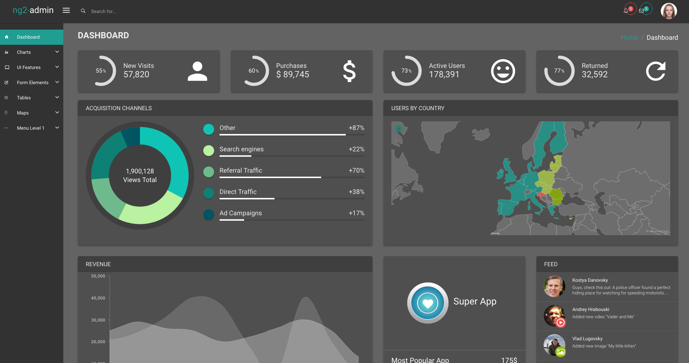

We tried to make the process of color scheme customization as easy as possible. 

By default ng2-admin has three built-in color profiles: ng2 (default blue sheme), mint and blur.
This article will help you to create your own color profile.
Let's say you want to make ng2-admin dark theme.

First we advise you to take some existing colorscheme file as a starting point. 
For light themes we suggest taking `src/app/theme/sass/conf/colorScheme/_mint.scss` and for 
dark `src/app/theme/sass/conf/colorScheme/_blue.scss`.
As we want a dark theme, we're taking `blue`.

1) Copy `src/app/theme/sass/conf/colorScheme/_mint.scss` to `src/app/theme/sass/conf/colorScheme/_dark.scss`:
<br><br>

2) Include your colorscheme file in `src/app/theme/sass/conf/conf.scss`.

To do this, replace
```scss
@import 'colorSchemes/ng2';
```

with

```scss
@import 'colorSchemes/dark';
```
<br><br>

3) Change the color scheme enabled:

Open `src/app/theme/theme.config.ts`.
Uncomment the following line

```javascript
  //this._baConfig.changeTheme({name: 'my-theme'});
``` 

and put your theme name, in our case it is `dark`

```javascript
  this._baConfig.changeTheme({name: 'dark'});
``` 
Beside notifying the system which scheme is currently enabled, this also puts a css class to a main element 
of the page. Thus you can freely create theme-specific css selectors in your code without breakking other themes' styles.

For example like this:
```scss
. dark .card-body {
  background-color: white;
}
```
<br><br>

4) Change the colors:

Now you can start changing the colors.
For example, after playing a bit with different colors, we changed the 2 first main variables in `_dark.scss` file:
```sass
$body-bg: #636363;
$bootstrap-panel-bg: rgba(#000000, 0.2);

```

After this is done, you need to setup javascript to use the **same colors**. These colors 
are used for javascript charts and other components (maps, etc); 
Let's completely change the JS colors to a new set.
To do this, add the following code to the configuration block inside `src/app/theme/theme.config.ts`:
```javascript
  let colorScheme = {
    primary: '#209e91',
    info: '#2dacd1',
    success: '#90b900',
    warning: '#dfb81c',
    danger: '#e85656',
  };
  this._baConfig.changeColors({
    default: '#4e4e55',
    defaultText: '#e2e2e2',
    border: '#dddddd',
    borderDark: '#aaaaaa',

    primary: colorScheme.primary,
    info: colorScheme.info,
    success: colorScheme.success,
    warning: colorScheme.warning,
    danger: colorScheme.danger,

    primaryLight: colorHelper.tint(colorScheme.primary, 30),
    infoLight: colorHelper.tint(colorScheme.info, 30),
    successLight: colorHelper.tint(colorScheme.success, 30),
    warningLight: colorHelper.tint(colorScheme.warning, 30),
    dangerLight: colorHelper.tint(colorScheme.danger, 30),

    primaryDark: colorHelper.shade(colorScheme.primary, 15),
    infoDark: colorHelper.shade(colorScheme.info, 15),
    successDark: colorHelper.shade(colorScheme.success, 15),
    warningDark: colorHelper.shade(colorScheme.warning, 15),
    dangerDark: colorHelper.shade(colorScheme.danger, 15),

    dashboard: {
      blueStone: '#005562',
      surfieGreen: '#0e8174',
      silverTree: '#6eba8c',
      gossip: '#b9f2a1',
      white: '#10c4b5',
    },
  });
``` 
Here we defined a list of main colors `colorScheme` and then made light and dark versions of those using `colorHelper` methods. 
We also defined a couple of custom colors for dashboard charts.


That's basically it! Right now your admin application should look like this:



For further reference, please look in
- Colorscheme scss file (`src/app/theme/sass/conf/colorScheme/_ng2.scss`, `src/app/theme/sass/conf/colorScheme/_mint.scss` and `src/app/theme/sass/conf/colorScheme/_blur.scss`)
- `src/app/theme/theme.configProvider.js` to understand which javascript colors can be changed
- If you want to know how to change the theme to blur, read the [following article](/ng2-admin/articles/014-switch-to-blur-theme/)